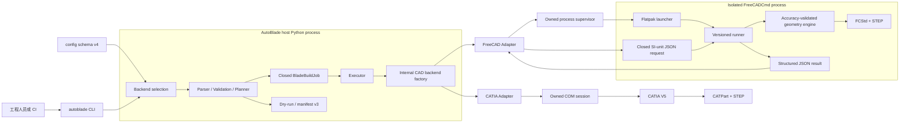

# AutoBlade 0.3.0 目标架构

> **状态：已接受的目标设计，尚未实现。** 本文不能作为当前版本已经支持
> FreeCAD、Linux 建模或 `autoblade` Python namespace 的证据。当前 `0.2.0`
> 实现见[架构说明](architecture.md)，迁移顺序和退出门槛见
> [`0.3.0` 实施计划](plans/autoblade-0.3.0.md)。

## 目标与系统边界

`0.3.0` 把产品身份从 CATIA AutoBlade 迁移为 AutoBlade，并在保留
Windows/CATIA 建模能力的同时增加 Linux/FreeCAD 后端。两个后端共享输入、
任务和命令语义，但各自拥有 CAD 进程、原生特征和导出实现；共享核心不加载
CATIA COM 或 FreeCAD Python 模块。

首个目标支持矩阵为：

| 平台 | CAD 后端 | `0.3.0` 目标状态 |
| --- | --- | --- |
| Windows 11 x64 | CATIA P3 V5-6R2020 | 保持既有 preview 支持和默认 backend |
| Linux x86_64 | Flatpak FreeCAD 1.1.3 | 新增 preview 支持 |
| Windows | FreeCAD | 后续认证，不是 `0.3.0` 退出条件 |
| Linux | 原生 `FreeCADCmd` | 保留类型化 Launcher 扩展点，尚不认证 |

`0.3.0` 仍只交付受控团队使用的内部 wheel。公共 PyPI、独立 EXE、第三方
CAD 插件 API、并行 CAD 调度和完整 FreeCAD 参数化输入编辑器不是目标。

## 目标组件与数据流



### Host 进程职责

- 配置选择、CSV 解析、领域校验、跨文件引用闭合、任务展开和输出冲突检查；
- 在 Planner 阶段确定 backend 和真实制品路径，使 dry-run 无需启动 CAD；
- 通过内部类型化 factory 把任务交给一个后端，不做自动探测或静默回退；
- 监督 FreeCAD 子进程，解释 timeout、退出码和结构化结果，并验证最终制品；
- 批任务记录单项结果并继续，但用户中断会停止整个调用。

### CAD 后端职责

- 把共享的 m/deg 领域数据转换为 CAD 边界要求的单位和对象；
- 创建原生几何、更新模型、保存原生文件并导出 STEP；
- 只管理自己创建的会话、文档、进程和暂存文件；
- 把厂商异常映射为 backend unavailable、timeout、protocol、geometry、
  artifact validation 或 cleanup 等项目错误。

Backend factory 是内部模块 seam，不是动态发现的公共插件协议。CATIA 继续使用
每任务一个 `DispatchEx` 独占 COM 会话；FreeCAD 使用每任务一个
`FreeCADCmd` 子进程。共享核心不得导入任何一方的运行时对象。

## CLI、配置与规划契约

`create`、`batch` 和 `sweep` 都增加命令级 `--backend catia|freecad`；独立入口
继续拥有同一选项。解析优先级固定为 CLI 参数、选中配置、内置 `catia` 默认值，
不同操作系统不会改变默认 backend。

目标配置 schema 为 `4.0.0`：

```toml
version = "4.0.0"

[defaults]
backend = "catia"

[freecad]
launcher = "flatpak"
app_id = "org.freecad.FreeCAD"
timeout_seconds = 900
```

`3.0.0 → 4.0.0` 使用既有显式预览、摘要校验、备份和原子替换流程。规范用户配置
目录迁移为 `autoblade`；仅当新目录不存在时才读取旧 `catia-autoblade` 目录并
警告，持久化只写新目录。如果两个目录同时存在，新目录唯一胜出。

`sweep` manifest 直接升级到 schema v3：顶层记录唯一 `backend`，每个任务使用
带类型的 `artifacts` 描述 native model 和 STEP，不保留 v2 `output_files` 过渡
字段。一次命令不能混用后端。

`--dry-run` 执行完整输入验证、任务展开、制品规划和冲突检查，但不检查 CAD 是否
安装，也不启动外部进程。`doctor` 默认只检查最终选中的 backend，可由
`--backend` 覆盖；`--all` 显式检查全部后端，任何一个 FAIL 都返回非零。
FreeCAD doctor 会运行短暂 headless 探针，检查 launcher、版本、FCStd 创建与重开、
以及目标路径可见性，而不是生成完整叶片。

## FreeCAD 进程与协议边界

首个认证命令为：

```text
flatpak run --command=FreeCADCmd org.freecad.FreeCAD <runner.py>
```

本机已验证该入口可返回 FreeCAD 1.1.3；AutoBlade 不负责安装或升级 Flatpak。
1.1.3 是无警告的认证版本；其他 `>=1.1` 版本允许运行但报告未认证警告，低于
1.1 的版本拒绝运行。CI 和 `0.3.0` 发布证据固定使用 1.1.3。

Runner 是随 wheel 分发的固定脚本，不能由请求指定任意模块或函数。Host 与 Runner
通过请求和结果 JSON 通信；两者都有严格 `schema_version`，遇到未知版本立即失败。
请求只包含已经校验、闭合的任务数据、明确的 `length_unit = "m"`、尾缘拓扑、
暂存目标和建模选项，不重新读取或解释 CSV。Runner 在 FreeCAD 边界把长度转换为
mm，并只向结果 JSON 和捕获的 stdout/stderr 报告状态。

每个任务在目标输出文件系统内获得独立隐藏暂存目录，以便 Flatpak 访问并保持
同文件系统发布。成功或失败结束后清理请求、结果和非保留中间文件。Host 完整
捕获输出，普通模式只显示结构化摘要，`--verbose` 才呈现完整诊断；成功任务不
额外生成日志文件。

单任务默认 timeout 为 900 秒，可由配置和命令行覆盖，不自动重试。Timeout 只在
已经得到可识别 FCStd 时尽力保留失败快照；不能安全取得时只报告 timeout。
Ctrl-C 终止当前 AutoBlade 所属进程、清理暂存并停止整个调用。实现不得使用会
终止用户 FreeCAD GUI 的全局 `flatpak kill`。

未来 NativeLauncher 只能接受经类型、存在性和可执行性校验的 executable path，
不能退化为自由 shell command。

## FreeCAD 几何构造与模型交付

**路线重新评估中。** 用户于 2026-09-08 明确要求精度优先，
[ADR-0005](adr/0005-prioritize-geometric-accuracy.md) 替代原生 Loft 限定。
已验证的旧原型与偏差见[诊断记录](validation/freecad-deviation-analysis-2026-09-08.md)。

Host 仍只传入已闭合 SI 单位任务；CAD 子进程负责几何构造和边界单位转换。
候选包括原生受约束曲面、截面/导引曲线网络和自定义算法。截面与前后缘可以
成为真实驱动约束，不再预先限定为 `ReferenceOnly`。正式接口、对象树和算法
依赖在阶段 2 对比后确定，不把探索性曲面快照写成已经完成的产品能力。

不要求不同翼型点数相同；保持 TE→LE→TE 输入语义、变换顺序与尖/钝拓扑。
任何重新参数化、近似或采样均必须显式记录参数及对原始输入的几何误差。
不得为绕过失败静默删点、移动点或钝化尾缘。

FCStd 交付可以采用原生依赖、带明确安装依赖的重建对象，或几何快照加可重建
输入/算法参数。只有实际保存重开、重建及精度验证通过后才选择交付方式；
静态结果不能宣称拥有 Sketch→结果的参数化依赖。输入摘要、算法版本、单位
与依赖必须可追溯，重建不依赖用户原工作区的绝对路径。

精度优先不等于放弃生命周期、依赖许可、headless、有效单实体或 STEP 验证。
具体工程公差尚未批准，须区分求解容差、测量误差、输入保持误差和跨后端差异。

## 制品与 STEP 契约

| 后端 | 原生模型 | 中性模型 |
| --- | --- | --- |
| CATIA | `.CATPart` | `.stp` |
| FreeCAD | `.FCStd` | `.stp` |

两个文件组成一个逻辑制品集。Planner 发现任一目标已存在时都执行现有冲突与覆盖
流程，不能把两次运行产生的文件拼成一个结果。跨后端比较由调用者指定不同输出
目录，不自动增加 backend 后缀。

FreeCAD 在同一暂存目录生成 FCStd 和 STEP，依次验证文件存在、非空、FCStd 可
重开并按声明方式重建、STEP 可重开且包含一个有效实体后，才发布到最终位置。文件系统
不能把两个文件通过一次 rename 同时提交，因此 Adapter 必须以回滚保护发布步骤；
任何部分发布都不能返回成功。

FreeCAD STEP 固定为 AP242DIS 几何、单位 mm，并在独立进程内显式设置 schema、
单位、精度和曲面写出参数；不读取或持久修改用户 GUI 偏好，也不宣称完整 AP242
产品数据交换。具体 precision 数值由几何原型测量后提出，并经工程责任人批准。
FreeCAD headless 与 OCCT STEP writer 的能力依据见
[Headless FreeCAD](https://github.com/FreeCAD/FreeCAD-documentation/blob/main/wiki/Headless_FreeCAD.md)
和 [OCCT STEP guide](https://github.com/Open-Cascade-SAS/OCCT/blob/master/dox/user_guides/step/step.md)。

`--keep-failed-model` 在几何失败且仍有可保存文档时提升一个不覆盖历史结果的失败
FCStd，不导出 STEP；旧 `--keep-failed-part` 暂作为弃用 alias。成功的普通
`create`/`batch` 不增加 sidecar JSON，来源元数据保存在 FCStd；sweep manifest
仍是扫描级可序列化记录。

## 正确性与认证边界

默认 pytest 使用 fake COM、fake process runner 和临时文件，不启动真实 CAD。
真实 Linux FreeCAD job 使用经过许可审查的 CATIA STEP 黄金基线，比较：

- STEP 可重开、形状有效且恰有一个 solid；
- 体积、包围盒和质心；
- 输入站位截面偏差；
- 表面采样最大值和 RMS 偏差。

跨后端不比较 CAD 文件字节、面数、边数或拓扑编号。黄金基线是重要参照，但输入
契约和经批准的工程公差拥有最终权威；更新必须由 CATIA 显式生成、记录版本与摘要
并人工批准，FreeCAD 测试不能改写期望结果。详细案例、CI 和发布门禁由
[`0.3.0` 实施计划](plans/autoblade-0.3.0.md)维护，决策理由见
[ADR-0004](adr/0004-use-curated-cross-backend-golden-baselines.md)。

## 可行性闸门与未定数值

下列内容必须由原型和真实证据确定，不能在实现前编造：

- 受约束曲面、Gordon 或自定义算法对 300/253/249 点多翼型、260 点钝尾缘和
  1000 点密集轮廓的精度、稳定性、重建依赖与性能；
- AP242DIS writer 的最终 precision 数值；
- 体积、截面、表面、质心和包围盒的默认公差与有理由的案例覆盖；
- 第一批公开 CATIA STEP 基线及其许可、环境和摘要。

如果几何精度、尖/钝拓扑、保存重开/声明的重建方式或黄金对照任一关键条件失败，
正式集成停止并返回设计决策。替代路线按 ADR-0005 显式评估，不允许静默改变输入。

## 决策记录

- [ADR-0001：采用 AutoBlade 多后端产品身份](adr/0001-adopt-autoblade-multi-backend-identity.md)
- [ADR-0002：隔离 CAD 后端与 FreeCAD 进程](adr/0002-isolate-cad-backends-and-freecad-processes.md)
- [ADR-0003（已替代）：生成原生可重算的 FreeCAD 模型](adr/0003-build-native-recomputable-freecad-models.md)
- [ADR-0005：以几何精度决定建模路线](adr/0005-prioritize-geometric-accuracy.md)
- [ADR-0004：使用经治理的跨后端黄金基线](adr/0004-use-curated-cross-backend-golden-baselines.md)
